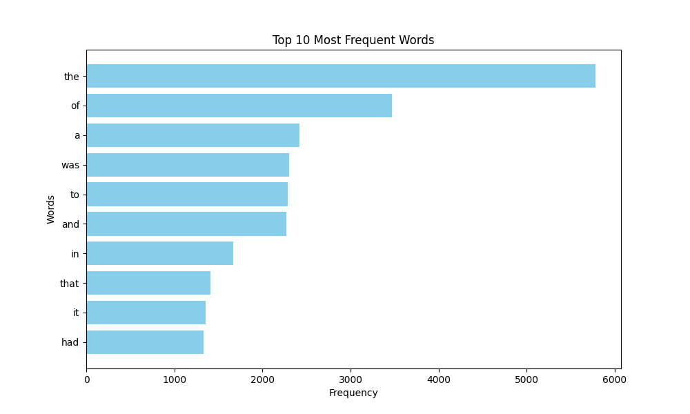

# Tier 2. Module 1: Computer Systems and Their Fundamentals

## Topic 9 - Asynchronous programming
## Homework

### Task

Write a Python script that will read all the files in the source folder specified by the user and distribute them to subfolders in the output folder based on the file extension. The script should perform the sorting asynchronously for more efficient processing of large number of files.

### Instructions

1. Import the required asynchronous libraries.
2. Create an `ArgumentParser` object to handle command line arguments.
3. Add the necessary arguments to specify the source and destination folders.
4. Initialize the asynchronous paths for the source and target folders.
5. Write an asynchronous `read_folder` function that recursively reads all the files in the source folder and its subfolders.
6. Write an asynchronous `copy_file` function that copies each file to the appropriate subfolder in the target folder based on its extension.
7. Configure error logging.
8. Run the `read_folder` asynchronous function in the main block.

### Acceptance criteria

- The code successfully performs asynchronous reading and copying of files.
- Files are divided into subfolders based on their extensions.
- The program correctly handles command line arguments.
- All errors are logged.
- The code is readable and complies with PEP 8 standards.

## Topic 10 - Introduction to parallel computing
## Homework

### Task

Write a Python script that loads text from a given URL, analyzes the frequency of word usage in the text using the MapReduce paradigm, and visualizes the top words with the highest frequency of usage in the text.

### Instructions

1. Import required modules (`matplotlib` and others).
2. Take the MapReduce implementation code from the outline.
3. Create a `visualize_top_words` function to visualize the results.
4. In the main code block, get the text from the URL, apply MapReduce, and visualize the results.

### Acceptance criteria

- The code successfully loads the text from the given URL.
- The code correctly performs word frequency analysis using MapReduce.
- Visualization displays top words by frequency of use.
- The code makes efficient use of multithreading.
- The code is readable and complies with PEP 8 standards.
